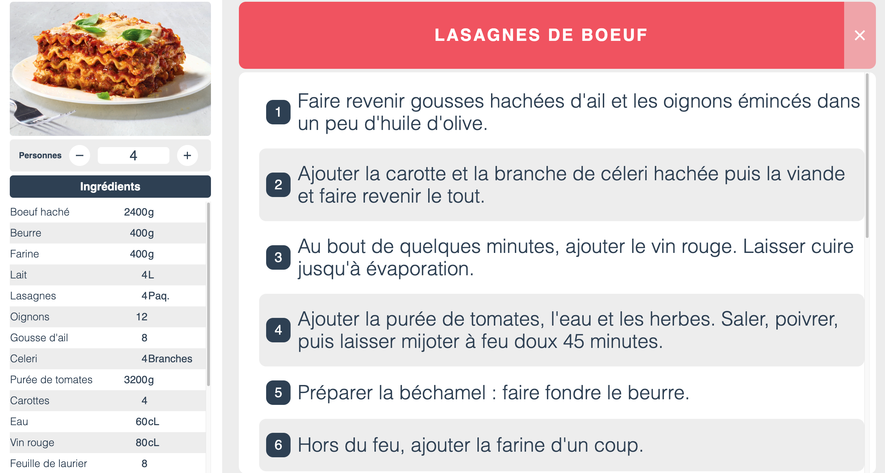

# Recipe panel - 

<!--  -->

<!--  -->

A cooking recipe panel for a home automation project. This app imports cooking recipe data from a json file to display it on a home automation screen.

---

## 🛠 Tech Stack

**Client:**

https://img.shields.io/badge/json-5E5C5C?style=for-the-badge&logo=json&logoColor=white

**Server:**

### In future

---

## 💡 Features

- Dynamic display of ingredients quantities according the guests number
- Scroll through the ingredients list and cooking steps

### Next features
- Recipe storage on server
- Add a recipe selection panel
- Add a recipe creation panel

---

## 💻 Softwares used

---

## 📲 Deployment

---

## 🎨 Color Reference

| Color      | Hex                                                                |
| ---------- | ------------------------------------------------------------------ |
| Light grey  |  `#EFEFEF` |
| Grey  |  `#CFCFCF` |
| Fusion red |  `#F25E6B` |
| Blue grey     |  `#34495E` |

---

## 📸 Screenshots

---

## 🔗 Links

